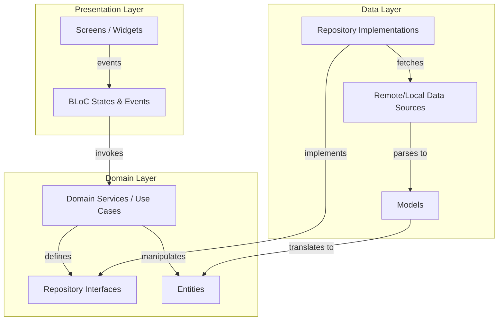
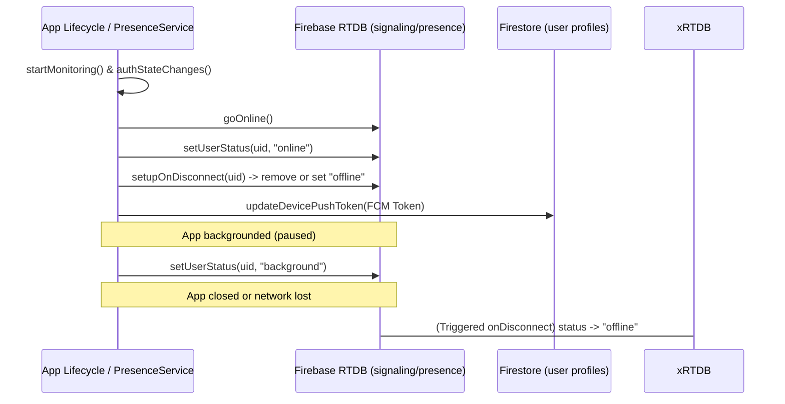
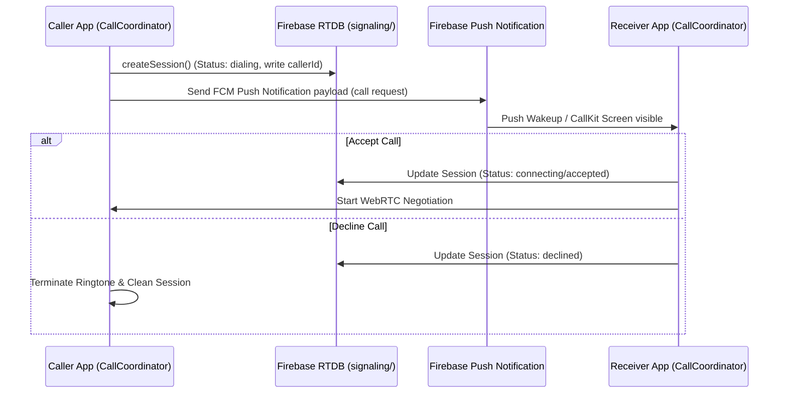
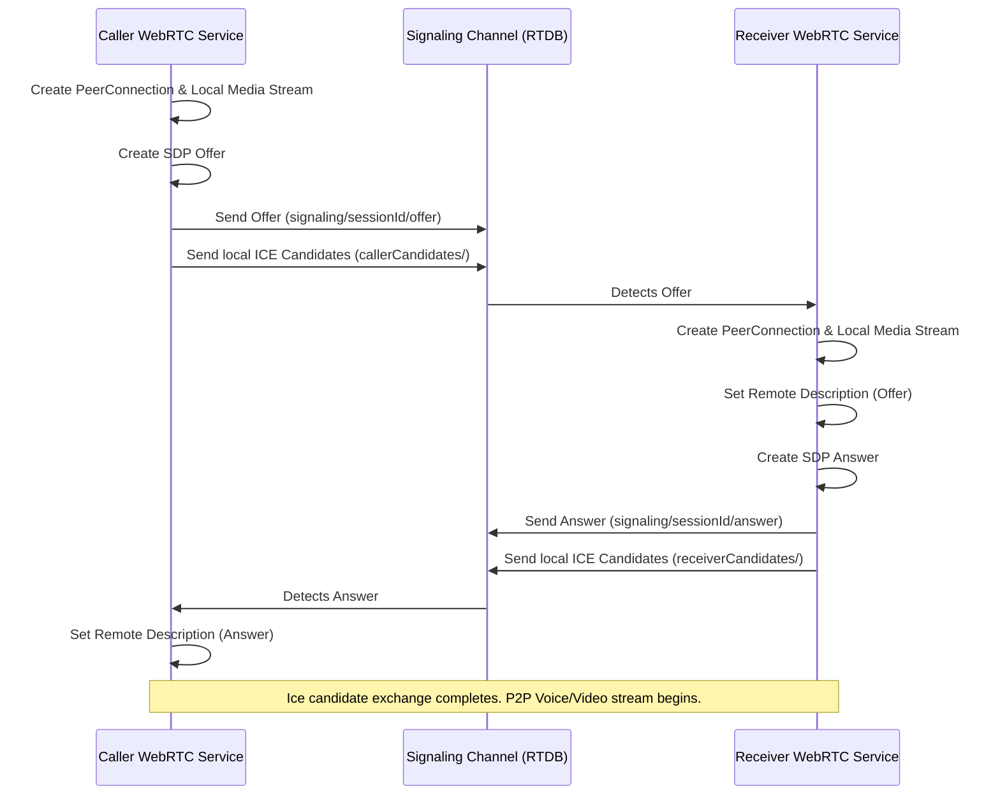

# Architecture of VanishLink

This document outlines the architectural patterns, flow dynamics, and implementation details of the **VanishLink** application.

---

## 1. Architectural Blueprint: Clean Architecture

VanishLink is designed around the principles of **Clean Architecture**, enforcing a strict separation of concerns into three primary layers: **Domain**, **Data**, and **Presentation**. This isolation ensures that the business logic (Domain) remains pure and agnostic of outer concerns, while the UI (Presentation) and backend services (Data) can evolve independently.

### Layer Boundaries
- **Domain Layer:** Containing only core entities, contract interfaces (repositories), and domain-specific services (e.g. `CallCoordinator`, `PresenceService`). It has zero dependencies on external frameworks, databases, or UI.
- **Data Layer:** Implements domain repository interfaces. Handles API calling, Firebase operations, and serialization logic (`Models` extending `Entities`).
- **Presentation Layer:** The Flutter UI layer. Standard UI controls and screens listen to the business logic components (BLoCs), which trigger updates based on domain logic.

---

## 2. State Management Pattern: BLoC

VanishLink relies on **BLoC (Business Logic Component)** for managing UI states reactively. 

Key BLoCs include:
- **`AuthBloc` / `SignInBloc`:** Manages user authentication, authorization state, registration, and Firestore profile synchronization.
- **`ChatsBloc`:** Handles the list of active chats, listing user matches, and overall conversation streams.
- **`MessageBloc`:** Manages real-time message streams, text inputs, vanishing timer transitions, and database persistence.
- **`PresenceBloc`:** Governs online, background, and offline presence status of contacts and friends.
- **`CallBloc` / `WebRtcBloc`:** Coordinates voice/video signaling states, incoming call requests, connection status updates, and peer negotiation states.

---

## 3. Real-Time Presence Flow

VanishLink maintains real-time user presence tracking through a combination of the application lifecycle observer and the **Firebase Realtime Database (RTDB)**.

### Flow Breakdown
1. **Lifecycle Tracking:** `PresenceService` listens to Flutter's `WidgetsBindingObserver` to capture state transitions (`resumed`, `paused`, `detached`).
2. **Real-time Status Updates:** On `resumed`, the user is marked as `online` in RTDB. On `paused`, they are set to `background`. On `detached` or socket termination, RTDB automatically runs the `onDisconnect` hook to transition the state to `offline`.
3. **FCM Registration:** When the user connects, `PresenceService` requests push permissions, retrieves the FCM device token, and uploads the token alongside microphone/camera permissions to Firestore to facilitate signaling.

---

## 4. End-to-End Call Flow

Voice and video calls are orchestrated by the `CallCoordinator` using a combination of Firestore, Firebase Cloud Messaging (FCM), and CallKit/WebRTC.

### Flow Breakdown
1. **Call Initiation:** The caller invokes the `CallCoordinator` to create a call session document in Firestore/RTDB. The state transitions to `calling`.
2. **Push Delivery:** The signaling push notification is sent to the recipient device (via APNs/FCM). On mobile, the `CallPresentationAdapter` intercepts this to trigger native CallKit UI.
3. **Call Accept/Decline:**
   - If **accepted**, the recipient launches the `CallScreen`, updating the call state to `connecting`, and triggers the WebRTC loop.
   - If **declined**, the session state is updated to `declined`, stopping ringtones on both sides and deleting the session.

---

## 5. WebRTC Negotiation Flow

WebRTC negotiation utilizes Firebase Realtime Database as the signaling channel to transfer SDP (Session Description Protocol) offers, answers, and ICE (Interactive Connectivity Establishment) candidates.

### Key Elements of the Negotiation:
- **Signaling Channel:** Supported by `SignalingRepositoryImpl` which writes `offer`, `answer`, and pushes individual candidate objects to Firebase Realtime Database.
- **ICE Restart Capability:** Facilitated in WebRTC service to handle reconnection on network changes.
- **Clean Disconnection:** Once the call is ended, `deleteSession` cleans the RTDB signaling path, and the `RTCPeerConnection` is closed and garbage collected.
